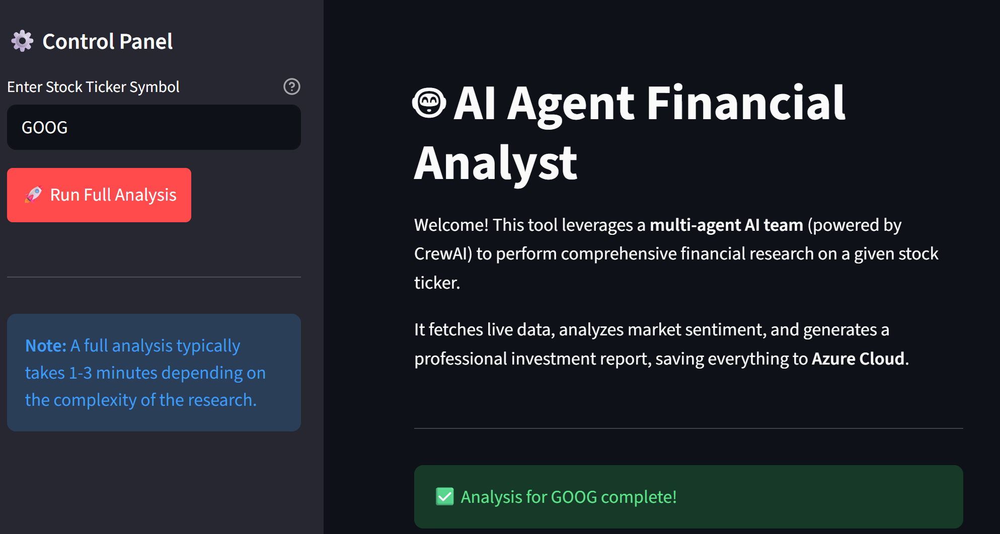
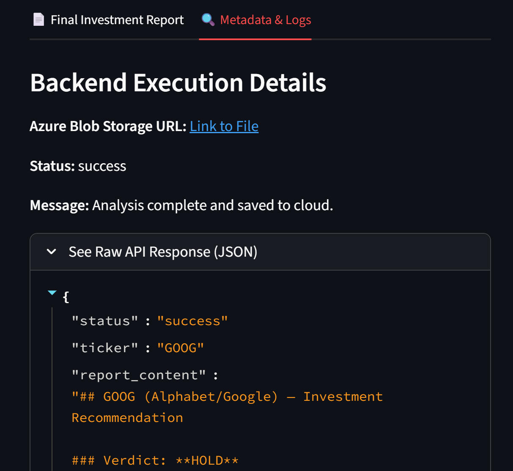
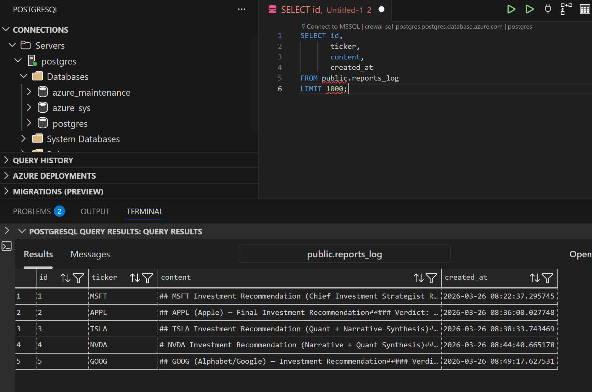
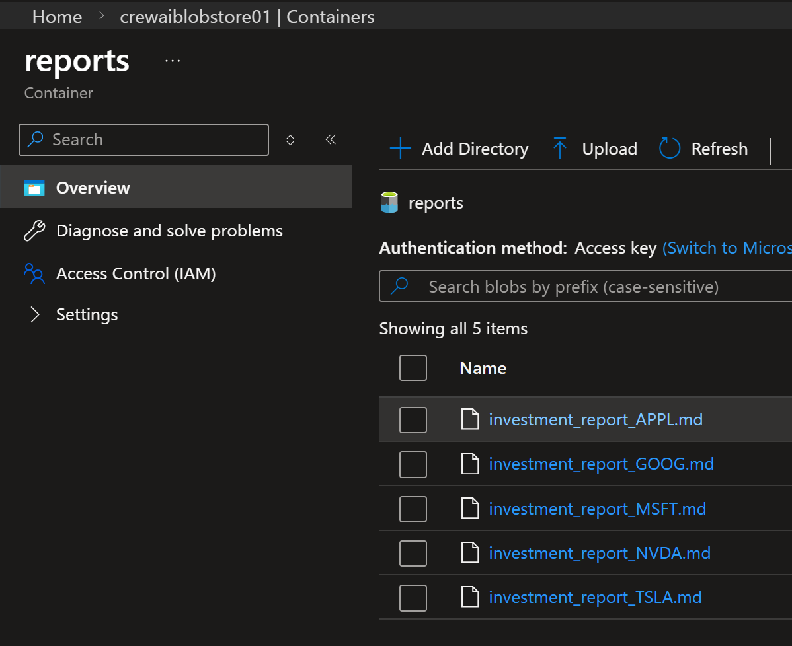
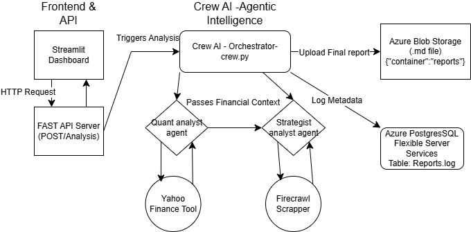

## Final Product 

=======================================

========================================

### Check meta data logs in postgres

### Validate reports in azure blob store

## How to run application

### UI

Run below commands in two windows(cmd) with venv enabled 

- For Fast API :

'''
uv run uvicorn src.api.main:app --reload

'''

- For FrontEnd Steamlit

'''
uv run streamlit run src\frontend\app.py

'''

### with out UI , produce output in terminal 

'''
uv run main.py

''' 

### Architecture

- 

### Create project Structure

### Create folders

'''
mkdir src\agents\tools src\api src\shared src\frontend   .github\workflows

'''

### Create files

- User powershell instead of command due to limiation by design can only create one file at a time but not multiple in one command

- Powershell command

'''
$files = @(
  "src\agents\__init__.py"
  "src\agents\crew.py"
  "src\agents\agents.py"
  "src\agents\tasks.py"
  "src\agents\tools\__init__.py"
  "src\agents\tools\search.py"
  "src\agents\tools\scraper.py"
  "src\agents\tools\financial.py"
  "src\api\__init__.py"
  "src\api\main.py"
  "src\api\models.py"
  "src\api\routes.py"
  "src\shared\__init__.py"
  "src\shared\config.py"
  "src\shared\database.py"
  "src\shared\storage.py"
  "src\frontend\app.py"
  ".env.example"
  "Dockerfile"
)

New-Item $files -ItemType File -Force

'''

- Setup azure blob storage account with anonymous access enabled to access blobs from container

- Setup Azure PostgresSql flexible server services resource 

- Setup OpenAI models with OpenAI and choose resoning model

- Get Firecrawl API key from Firecrawl 

