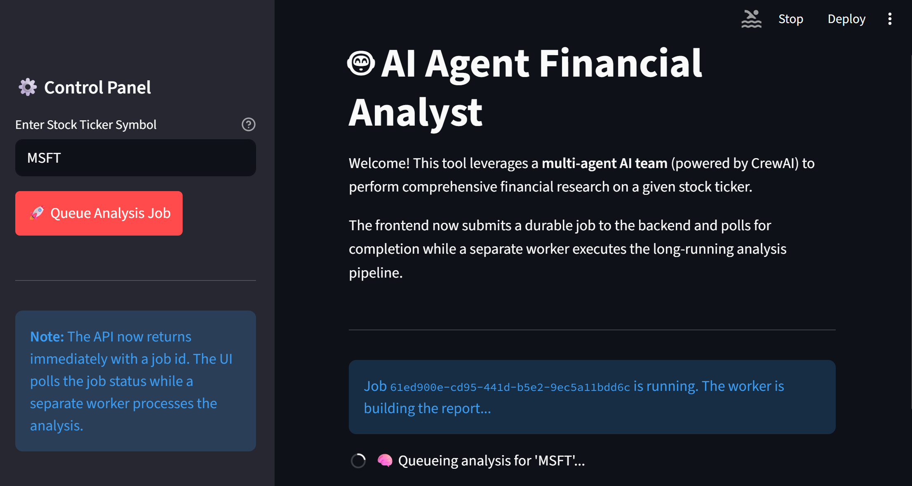
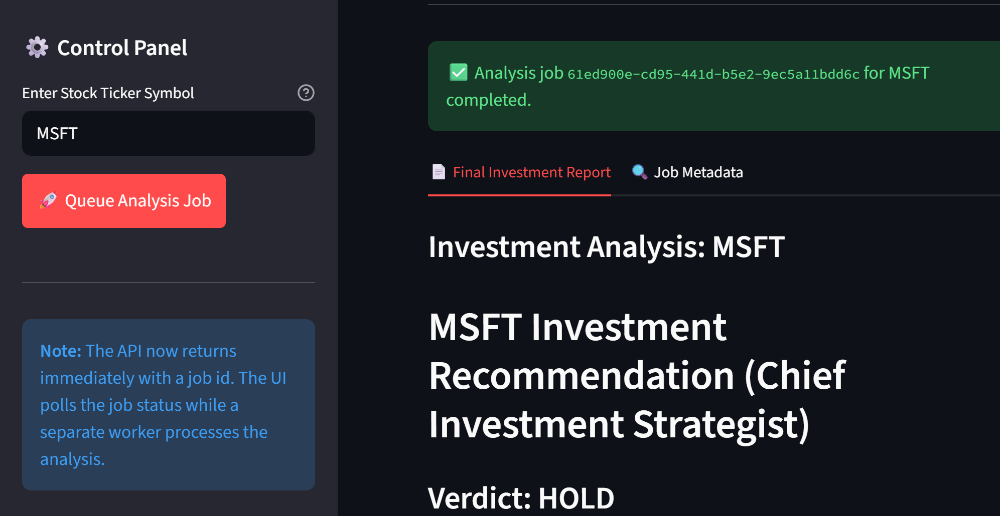
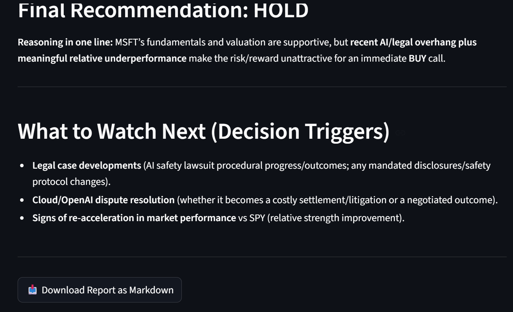
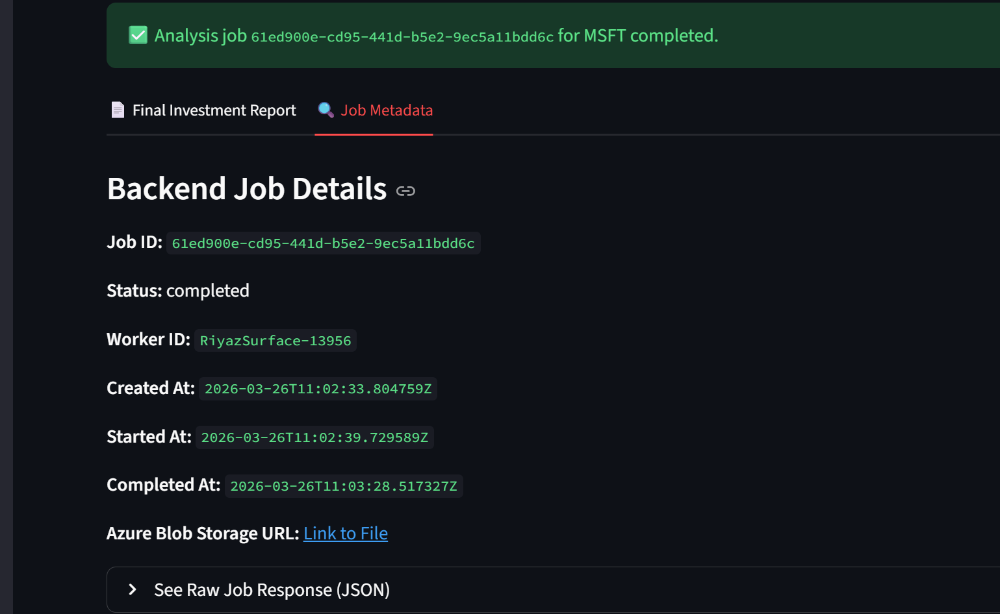
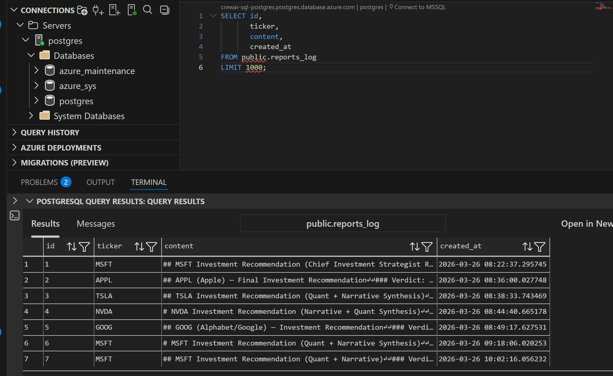

# Agentic AI Quantitative Analysis System

Production-oriented multi-agent financial research platform built to demonstrate applied AI systems engineering, asynchronous backend design, and cloud-integrated workflow orchestration.

At a high level, the platform accepts a stock ticker, coordinates specialized AI agents to research the company, generates an investment memo, and persists both the final artifact and job metadata across cloud services.

This repository demonstrates how to move beyond a prompt-driven prototype into a platform-style AI application with:

- multi-agent orchestration using CrewAI
- an asynchronous API and background worker model
- durable job tracking in PostgreSQL
- report persistence in Azure Blob Storage
- a lightweight analyst-facing Streamlit UI

It is aimed at architects, AI engineers, and backend developers who care about reliability, service boundaries, operational correctness, and how agent workflows behave in a real system rather than in a notebook.

## Portfolio Positioning

This project is intentionally structured as a technical portfolio artifact for roles involving:

- applied AI engineering
- agentic systems design
- backend platform engineering
- cloud-native service integration
- productionization of long-running LLM workflows

The focus is not only on model usage, but on the surrounding system design required to make AI workflows usable in practice:

- asynchronous request handling
- background worker execution
- durable job state
- cloud artifact persistence
- worker liveness and stale-job recovery
- separation of UI, API, orchestration, and persistence concerns

## Executive Summary

The platform accepts a stock ticker, launches a two-agent research workflow, produces a Markdown investment memo, and persists both the report artifact and execution metadata to cloud infrastructure.

The system uses a clear separation of concerns:

- a FastAPI service accepts analysis requests and returns immediately with a durable `job_id`
- a worker process claims queued jobs and executes the long-running CrewAI pipeline
- PostgreSQL acts as the source of truth for job state and report metadata
- Azure Blob Storage stores the final generated report
- Streamlit provides a simple analyst-facing interface for job submission and result review

This architecture is intentionally more realistic than a single blocking request/response AI demo. It addresses long-running inference workloads, cloud persistence, worker liveness, recoverability, and operational boundaries between synchronous user interaction and asynchronous AI execution.

## What The Platform Does

For a given stock ticker such as `MSFT`, `NVDA`, or `TSLA`, the system:

1. collects quantitative market and fundamentals data from Yahoo Finance
2. compares the target stock to `SPY` over a one-year period
3. searches recent market narrative and analyst/news context with Firecrawl
4. synthesizes quantitative and qualitative evidence into a final `BUY`, `SELL`, or `HOLD` recommendation
5. writes a Markdown investment report
6. stores the report in Azure Blob Storage
7. records job/report state in Azure PostgreSQL

## Why This Project Matters

This repository is not just about stock analysis. It demonstrates several engineering patterns that are directly relevant to AI platform and applied AI roles.

- **Agent orchestration**: decomposing analysis into specialist roles instead of using one generic model call
- **Production-oriented API design**: returning `202 Accepted` plus a durable job id instead of holding open a long HTTP request
- **Operational resilience**: worker heartbeats, stale job recovery, and explicit job lifecycle management
- **Cloud persistence**: durable storage for generated AI artifacts and execution metadata
- **Configurable model usage**: the model is controlled through environment configuration rather than being silently hardcoded
- **Clear interface boundaries**: UI, API, worker, orchestration, and persistence are separated into distinct modules

## High-Level Architecture


### Core Components

- **Frontend**: Streamlit dashboard for ticker submission and result review
- **API**: FastAPI service for job creation and job status retrieval
- **Worker**: background process that executes long-running analysis jobs
- **Agent Layer**: CrewAI orchestration, agent definitions, and task design
- **Tool Layer**: Yahoo Finance and Firecrawl integrations
- **Persistence Layer**: PostgreSQL for job state and report logs, Azure Blob for final report artifacts

## End-to-End Workflow

1. A user submits a ticker through Streamlit or via the API.
2. The FastAPI service creates a durable `analysis_jobs` row in PostgreSQL with status `queued`.
3. The API returns immediately with `202 Accepted` and a `job_id`.
4. A worker process heartbeats, claims the oldest queued job, and marks it `running`.
5. The worker executes the CrewAI pipeline:
   - the Quantitative Analyst gathers fundamentals and relative performance
   - the Investment Strategist gathers news/sentiment context and produces the final recommendation
6. The worker uploads the generated Markdown report to Azure Blob Storage.
7. The worker atomically records report data and marks the job `completed`, or marks it `failed` if execution breaks.
8. The frontend polls the job status endpoint until the result is ready.

## Agent Design

### 1. Senior Quantitative Analyst

Responsibilities:

- fetch key financial metrics
- compare the target stock against `SPY`
- identify numerical red flags
- provide structured financial context for downstream synthesis

Tools:

- `FundamentalAnalysisTool`
- `CompareStocksTool`

### 2. Chief Investment Strategist

Responsibilities:

- research recent news, analyst commentary, and sentiment
- synthesize narrative with the quantitative output from the first agent
- produce the final recommendation and investor-facing report

Tools:

- `SentimentSearchTool`

## Engineering Decisions

### Asynchronous Job Model

Long-running AI analysis should not sit inside a single blocking HTTP request. This project uses:

- `POST /analyze` for job submission
- `GET /analyze/{job_id}` for polling
- a dedicated worker process for long-running analysis execution

This is closer to how real AI-backed platforms handle non-trivial latency and external dependencies.

### Durable Job State

PostgreSQL stores:

- job lifecycle state: `queued`, `running`, `completed`, `failed`
- worker ownership
- timestamps for job progression
- report content and report URL

This makes the system observable and recoverable across process restarts.

### Worker Liveness and Recovery

The worker periodically heartbeats itself and the running job. Stale jobs are re-queued if a worker disappears mid-execution. This protects the system from permanently orphaned long-running jobs.

### Atomic Completion Path

The final report log and job completion state are written together at the database layer to reduce inconsistent outcomes where side effects succeed but job state does not.

## Senior-Level Engineering Signals

The main engineering value of this project is not any single library choice. It is the way the system is shaped around real operational constraints.

### 1. AI Workloads Are Treated As Distributed Work, Not Controller Logic

The analysis workflow is long-running and dependent on multiple external systems. Instead of keeping that inside a request handler, the design moves execution into a worker and uses a durable polling contract at the API boundary.

### 2. State Is Explicit

The system models job state in PostgreSQL rather than relying on in-memory task status. This makes progress inspectable, failures observable, and recovery possible after process interruption.

### 3. Failure Modes Are Considered

The worker heartbeats itself, running jobs are lease-based, and stale work can be re-queued. This is a materially stronger design than a happy-path-only async wrapper.

### 4. Cloud Persistence Is Part Of The Product Contract

Generated reports are stored as artifacts in Azure Blob Storage, while metadata and job state live in PostgreSQL. This separation mirrors how many real AI platforms handle generated outputs versus operational data.

### 5. Configuration Drives Runtime Behavior

Model selection and worker timing are environment-driven, which is important for portability, cost control, and deployment flexibility.

## Technology Stack

| Layer | Technology |
|---|---|
| Agent orchestration | CrewAI |
| LLM provider | OpenAI |
| Quant data | yFinance |
| Web research | Firecrawl |
| API layer | FastAPI |
| UI layer | Streamlit |
| Relational persistence | PostgreSQL via SQLAlchemy |
| Artifact storage | Azure Blob Storage |
| Runtime config | Pydantic Settings + `.env` |

## Architectural Benefits

- **Scalable request handling**: user requests return quickly instead of waiting for long AI execution
- **Operational visibility**: job lifecycle is queryable and inspectable
- **Cloud-native persistence**: outputs and metadata are durable beyond process lifetime
- **Recoverability**: stale running jobs can be recovered when workers disappear
- **Composable extension path**: additional agents, tools, queues, or deployment targets can be introduced without rewriting the entire system

## Local Setup

### Prerequisites

- Python `3.12+`
- `uv`
- OpenAI API key
- Firecrawl API key
- Azure PostgreSQL connection string
- Azure Blob Storage connection string

### Environment Variables

Copy `.env.example` to `.env` and populate the values:

```env
OPENAI_API_KEY=""
OPENAI_MODEL_NAME="gpt-4o"
FIRECRAWL_API_KEY=""
AZURE_POSTGRES_CONNECTION_STRING=""
AZURE_BLOB_STORAGE_CONNECTION_STRING=""
WORKER_POLL_INTERVAL_SECONDS=5
JOB_HEARTBEAT_INTERVAL_SECONDS=15
JOB_STALE_AFTER_SECONDS=300
WORKER_ACTIVE_WITHIN_SECONDS=60
```

## Running The System

### Production-Style Flow

Run the application in three terminals.

1. Start the FastAPI service

```bash
uv run uvicorn src.api.main:app --reload
```

2. Start the worker

```bash
uv run python -m src.workers.analysis_worker
```

3. Start the Streamlit frontend

```bash
uv run streamlit run src/frontend/app.py
```

The frontend will submit a job, poll for progress, and display the final report when the worker completes processing.

### Direct CLI Execution

If you want to run the analysis pipeline directly without the API/UI job model:

```bash
uv run main.py
```

## API Contract

### Submit Job

`POST /api/v1/analyze`

Request:

```json
{
  "ticker": "MSFT"
}
```

Response:

```json
{
  "status": "queued",
  "job_id": "uuid",
  "ticker": "MSFT",
  "message": "Analysis job accepted. Poll the job status endpoint for progress."
}
```

### Check Job Status

`GET /api/v1/analyze/{job_id}`

Response includes:

- job status
- report content
- Azure Blob URL
- error message, if any
- created, started, and completed timestamps

### Health Endpoint

`GET /`

The root endpoint reports whether the API is reachable and whether at least one active worker heartbeat is available.

## Repository Structure

```text
src/
  agents/
    agents.py
    crew.py
    tasks.py
    tools/
      financial.py
      scraper.py
  api/
    main.py
    models.py
    routes.py
  frontend/
    app.py
  shared/
    config.py
    database.py
    storage.py
  workers/
    analysis_worker.py
main.py
```

## Screenshots

### Streamlit Dashboard



### Submitted Analysis View



### Report Rendering



### Metadata / Job Details



### PostgreSQL Metadata Logs



### Azure Blob Report Artifact


## What This Project Demonstrates

This project demonstrates practical capability in:

- designing agentic AI systems beyond toy prompts
- building service boundaries around long-running LLM workflows
- integrating AI pipelines with cloud storage and relational persistence
- handling operational concerns such as worker liveness and stale-job recovery
- exposing AI workflows through both API and UI layers
- structuring a Python codebase into composable backend, orchestration, and shared services

## Suggested portfolio Framing

The strongest framing is around system design and AI workflow productionization:

- Built a multi-agent financial research platform using CrewAI, FastAPI, Streamlit, PostgreSQL, and Azure Blob Storage
- Designed an asynchronous job-processing architecture for long-running AI workflows using durable job state and background workers
- Implemented cloud-backed report persistence, worker heartbeat monitoring, and stale-job recovery for more reliable agent execution
- Structured the application into modular API, worker, orchestration, tool, and persistence layers to support extensibility and operational clarity

## Disclaimer

This project is an engineering demonstration of agent orchestration and AI-assisted financial analysis. It is not intended to be used as financial advice.
